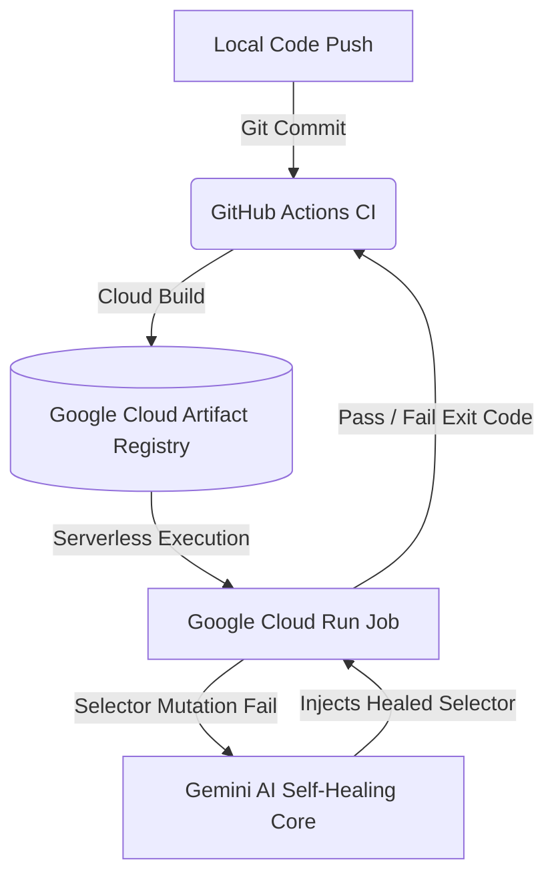

# 🤖 Autonomous Self-Healing Test Automation Pipeline

[](https://cloud.google.com/run)
[](https://ai.google.dev/)

An enterprise-grade, serverless test automation framework that combines **Microsoft Playwright** with **Google Gemini AI** to achieve autonomous self-healing UI testing. When web elements mutate and selectors fail, the AI dynamically inspects the DOM context, repairs the broken selectors in real-time, and ensures CI/CD pipelines never fail due to UI "test rot."

---

## 🏗️ Architectural Overview

The entire workflow bridges modern local development with cloud-native serverless execution:



1. **Local Authoring & Validation:** Tests are written locally using Playwright and secured via environment variable vaults.
2. **Version Control:** Changes are tracked and pushed via Git/GitHub.
3. **Containerized Build:** Google Cloud Build compiles the project into an auto-syncing Debian/Node container, fetching exact browser binaries dynamically.
4. **Secret Management:** Sensitive API credentials are securely fetched at runtime via **Google Secret Manager**.
5. **Serverless Execution:** Tests execute on demand inside **Google Cloud Run Jobs**, streaming logs back to GitHub Actions.

---

## 🛠️ Tech Stack & Tools

* **Test Automation:** [Playwright](https://playwright.dev/) (Chromium Headless)
* **AI / LLM Integration:** Google Gemini AI (via Model Context Protocol)
* **Containerization:** Docker (`node:20-bookworm`)
* **Cloud Infrastructure (GCP):** 
  * Cloud Run Jobs (Serverless Execution)
  * Cloud Build (CI Image Compilation)
  * Artifact Registry (Container Storage)
  * Secret Manager (Zero-Trust Credential Vault)
* **CI/CD Orchestration:** GitHub Actions (OIDC Secure Auth)

---

## 📂 Project Structure

```text
├── .github/
│   └── workflows/
│       └── playwright-cloud.yml   # Automated GCP deployment & execution pipeline
├── tests/
│   └── selfHealingTest.spec.ts    # Core Playwright test suite with AI wrapper
├── Dockerfile                     # Dynamic auto-syncing container build instructions
├── package.json                   # Framework dependencies and scripts
└── README.md                      # Project documentation
```

---

## 🚀 Getting Started (Local Setup)

### 1. Clone the Repository
```bash
git clone https://github.com/your-username/your-repo-name.git
cd your-repo-name
```

### 2. Install Dependencies
```bash
npm install
npx playwright install
```

### 3. Configure Environment Variables
Create a `.env` file in the root directory and add your Gemini API key:
```env
GEMINI_API_KEY=your_gemini_api_key_here
```

### 4. Run Tests Locally
```bash
npx playwright test
```

---

## ☁️ Cloud Deployment Setup (GCP & GitHub Actions)

To replicate this production setup in your own Google Cloud project:

1. **Enable GCP APIs:**
   ```bash
   gcloud services enable run.googleapis.com cloudbuild.googleapis.com secretmanager.googleapis.com
   ```

2. **Store Secrets in Google Secret Manager:**
   ```bash
   gcloud secrets create gemini-api-key --replication-policy="automatic"
   echo -n "YOUR_API_KEY" | gcloud secrets versions add gemini-api-key --data-file=-
   ```

3. **Grant Secret Accessor IAM Role to Cloud Run Execution Account:**
   ```bash
   gcloud secrets add-iam-policy-binding gemini-api-key        --member="serviceAccount:PROJECT_NUMBER-compute@developer.gserviceaccount.com"        --role="roles/secretmanager.secretAccessor"
   ```

4. **Configure GitHub Secrets:**
   Add your GCP service account JSON key as a repository secret named `GCP_SA_KEY` and your Google Cloud Project ID as `GCP_PROJECT_ID` under **Settings > Secrets and variables > Actions**.

---

## 💡 How Self-Healing Works

Traditional automation frameworks throw a fatal `TimeoutError` when a locator (e.g., `//button[@id='submit-v1']`) changes to `//button[@id='submit-v2']`. 

In this framework:
* The test wrapper catches the selector exception.
* It transmits the current DOM layout snapshot and error context to the **Gemini AI API**.
* Gemini evaluates the structural semantics, identifies the intended element, and returns the updated selector string.
* The test execution seamlessly resumes, drastically reducing UI test maintenance overhead.

